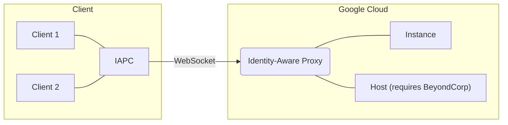

# iapc
Alternative client and Go library for Google Cloud's Identity-Aware Proxy. This is based on an implementation in [gartnera/gcloud](https://github.com/gartnera/gcloud) and the official gcloud source code. It aims to expose more functionality and have better performance. It's worth mentioning that the IAP speaks a slightly modified version of the SSH Relay v4 protocol documented [here](https://chromium.googlesource.com/apps/libapps/+/HEAD/nassh/docs/relay-protocol.md#corp-relay-v4).



## CLI
The CLI needs to acquire Application Default Credentials (ADC) to authenticate with the proxy, so make sure you're logged in.

```sh
$ gcloud auth login --update-adc
```

> [!IMPORTANT]
> Your VPC will need a firewall rule to allow traffic to the instance on the desired port (in this case 8080) from the well-known IAP range 35.235.240.0/20. See [Using IAP for TCP Forwarding](https://cloud.google.com/iap/docs/using-tcp-forwarding) for more information.

Here's an example of how to create a tunnel to an instance.

```sh
$ iapc to-instance prod-1 --project analog-figure-330721 --zone europe-west2-a
```

Here's an example of how to create a tunnel to a private IP or FQDN in a VPC. This **requires** BeyondCorp Enterprise and a TCP Destination Group.

```sh
$ iapc to-host 192.168.0.1 --project analog-figure-330721 --region europe-west2 --network prod --dest-group prod
```

## Example Code
This code example wires stdin/stdout to a port 8080 TCP connection on an instance. Run `nc -l 0.0.0.0 8080` on the instance to observe bidirectional communication.

> [!IMPORTANT]
> Your VPC will need a firewall rule to allow traffic to the instance on the desired port (in this case 8080) from the well-known IAP range 35.235.240.0/20. See [Using IAP for TCP Forwarding](https://cloud.google.com/iap/docs/using-tcp-forwarding) for more information.

```go
package main

import (
	"context"
	"io"
	"log"
	"os"

	"github.com/cedws/iapc/iap"
	"golang.org/x/oauth2/google"
)

func main() {
	tokenSource, err := google.DefaultTokenSource(context.Background())
	if err != nil {
		log.Fatal(err)
	}

	opts := []iap.DialOption{
		iap.WithProject("analog-figure-330721"),
		iap.WithInstance("prod-1", "europe-west2-a", "nic0"),
		iap.WithPort("8080"),
		iap.WithTokenSource(&tokenSource),
	}

	tun, err := iap.Dial(context.Background(), opts...)
	if err != nil {
		log.Fatal(err)
	}
	defer tun.Close()

	log.Println("Connected!")

	go io.Copy(tun, os.Stdout)
	io.Copy(os.Stdin, tun)
}
```

## License
This project is licensed under your choice of MIT or GPLv3.
